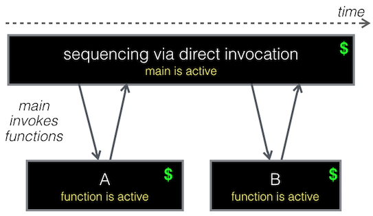

# Exercise 2 - Sequences to weave together Cloud Functions

Sequences are how we invoke Cloud Functions back-to-back. You could write a Cloud Function A to invoke Cloud Functions B and C, but that is inefficient and costly - and most importantly, not idiomatic Serverless design. Your instructor will go into details on why this is the case. 

Goals:
* Construct a Cloud Function sequence 
* Learn how to:
    * Create a sequence 
    * Passing params between sequences

## Why sequences?

Your instructor will go over these diagrams in detail before you launch into this exercise.

### BAD



### GOOD

## Creating a sequence

Your instructor will discuss sequences, then you can run the following code to create a sequence.

* We're going to reuse our example from the java-code folder (the Hello World example). This folder contains the solution UpperCaseFn.java, but try writing it on your own in the java-code folder.

* Create a new Cloud Function called: "upperCaseFn" that simply takes an input property of "greetings", and returns a "result".

    * Consider WHY I've asked you to name the input "greetings"

* Create a sequence
```ibmcloud fn action create greetAndUpperCaseFn --sequence helloJava,upperCaseFn```

    * As you can see, we create a new Cloud Fn sequence named "greetAndUpperFn" and wire up, in order, helloJava and upperCaseFn Cloud Functions.
     
* Execute the sequence
```ibmcloud fn action invoke --result greetAndUpperCaseFn --param name "Pratik"```

* We can wire together more than 2 if we want!

## Exercise review

Our objectives in this exercise:

* Construct a Cloud Function sequence 
* Learn how to:
    * Create a sequence 
    * Passing params between sequences

***Please ask your friendly workshop instructor if you have any questions!***

## EXTRA CREDIT
So you've finished before everyone else? No problem, here's some more stuff you can dive into!

* Create a new sequence that wires together 2 Cloud Functions 
    * validateInput Cloud Fn (make sure the user entered at least name, if not return a result of "MUST ENTER NAME")
    * helloJava Cloud Fn
